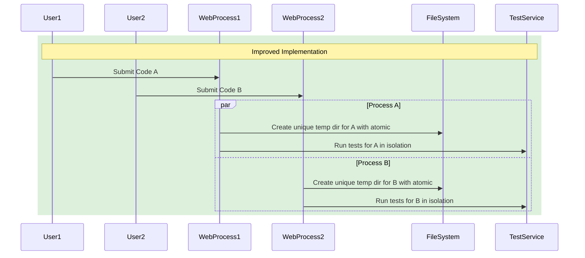
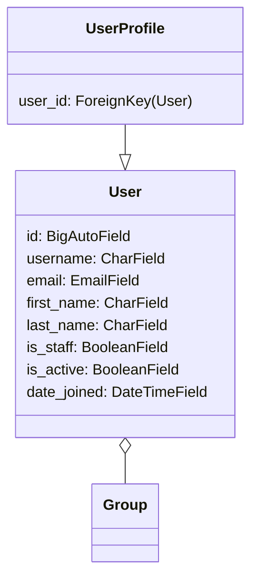
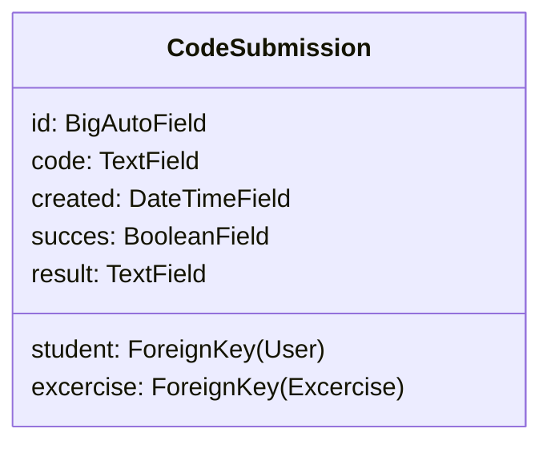
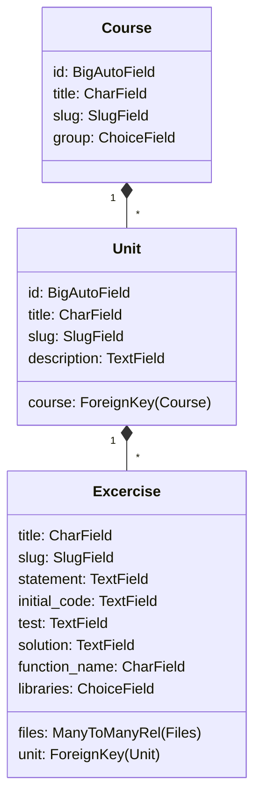
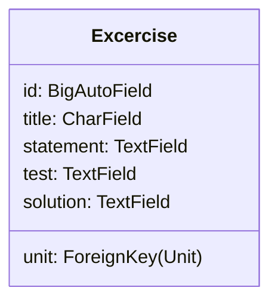
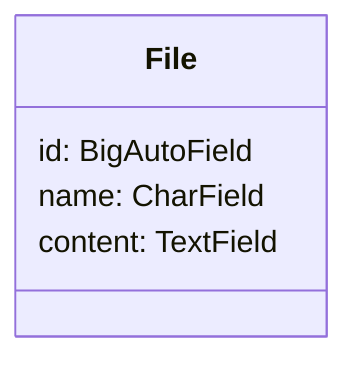
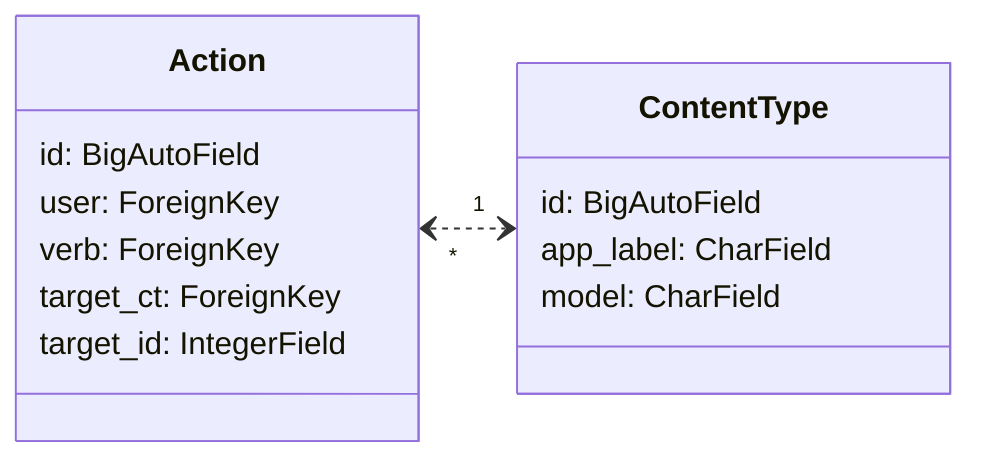

# rpl-etec

django re-purposed version of rpl2.0

# Try it
Available at
[www.rpletec.fun](www.rpletec.fun)

# Notes

## Concurrent Code Submission Handler



        submissions: ManyToManyField(CodeSubmission)
## User

Default `username` is `NAME[0]`+`SURNAME[1:]`:

* `pflores` is `Pablo Flores`



## Group

`Group` is a Django model that allows to group users and define permissions for them. For example, a `Teacher` group can
have permissions to **create** Units and Excercices , while a `Student` group can only have permissions to view
their courses and submit code.

### Student Group

`Permissions:

* Can view their courses
* Can view the course's units
* Can view the unit's excercises
* Can submit code for excercises
* Can view othe Student's Actions

### Teacher Group

Permissions:

* Can view their courses (admin-assigned)
* Can create and edit Units
* Can create and edit Excercises
* Can delete Units and Excercises
* Can view all Student's Actions
* Can add and remove students from their courses

`


## Code Submissions




## Course and Unit



## Excercise



## Files



## Actions

Record actions taken by users `USER` `VERB` `ACTIVITY` at `TIME`:

* `pflores` has completed `excercise 1` at `10:00`.
* `pflores` has completed `Unit 1` at `13:00`.

### Implementation

An `Action` is created every time a student completes a unit or excercise with `success` in all tests.

```python
class Action(models.Model):
    user = models.ForeignKey(settings.AUTH_USER_MODEL, related_name='actions', on_delete=models.CASCADE)
    verb = models.CharField(max_length=255)
    created = models.DatTimeField(auto_now_add=True)
    target_ct = models.ForeignKey(
        ContentType,
        blank=True,
        null=True,
        related_name='target_obj',
        on_delete=models.CASCADE
    )
    target_id = models.PositiveIntegerField(blank=True, null=True)
    target = GenericForeignKey('target_ct', 'target_id')
```

* `taget_ct`: A FK field that points to the ContentType model
* `target_id`: An integer field that points to the target object id (the `ACTIVITY` should have integer pk's)
* `target`: A GenericForeignKey field to the related object based on the combination of the two previous fields

### Model diagram



## Celery

### Configuration

We use *redis* as a message brocker and end point for celery. The idea is to have a single worker responsible for the
execution of any type of test involving code submissions (students) or excercise creation (teachers).

### Tasks

#### `test_code`

The `test_code` functional task is responsible for executing the `run_test` function from the `CodeTestingService`.

The task takes in the id of the CodeSubmission object by the user. This `submission_id` is used to retrieve the code,
then the code is tested using the `run_test` that checks _several system security checks_ beside testing the code with
the corresponding set of unittest cases assigned to the `Excercise`.

## Testing service

The `CodeTestingService` is a class that is responsible for retrieving the `Excercise` corresponding to the
`submission_id` generated by the code submission. Then, it gets the test cases from the `Excercise` and runs them to
test the submitted code. In the proccess, the service creates a temporary directory to store the code and the test
cases, checks the code for security issues, runs the test cases and deletes the temporary files.

## CodeSubmission

